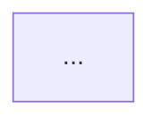

# System Architect

Take a one-paragraph project idea and turn it into a real architecture: the
components **this specific idea** needs, a mermaid flowchart of how they
connect, and a plain-English sentence explaining each one. Save it to
`project-blueprint/architecture.md`.

## Input

A one-paragraph description of a project idea, in plain language, from someone
who may not be technical. That paragraph is the entire specification — read it
closely. Every noun in it is a candidate component; every verb is a candidate
data flow.

If no idea has been given, ask for one paragraph describing what the project
does and who uses it, then stop. Do not invent an idea to design against.

## Hard rules

- **Design for the idea that was actually described.** The paragraph names
  specific things — a user type, a data source, an action, an output. Those
  must appear in the architecture, using the idea's own vocabulary.
- **Never emit a generic template.** A diagram that would be identical for a
  recipe app, a logistics tracker, and a hiring tool is a failure of this
  Skill, not a neutral starting point. See the anti-template test below.
- **Only include a component the idea needs.** Every box must trace to
  something in the paragraph. No speculative Redis, no message queue, no
  Kubernetes, no microservices unless the idea's own requirements force it.
- **Include an AI/agent layer only if the idea calls for it.** If the paragraph
  describes generating, summarizing, classifying, conversing, recommending, or
  deciding, it does. If it describes storing and displaying records, it does
  not.
- **Plain English for the explanations.** One sentence per component, no
  jargon, understandable by the person who wrote the paragraph. "The database
  stores every saved recipe so they're still there tomorrow" — not "persistence
  layer providing durable state."

## Procedure

1. Read the idea paragraph. Extract, literally: who uses it, what they do with
   it, what data it holds, what it produces, and anything outside the system it
   must talk to (payments, email, maps, a model provider, an existing tool).
2. Derive the component list from that extraction — see Component identification.
3. Determine the data flows: for each pair of connected components, what moves
   between them and in which direction. Name the actual payload ("photo of the
   receipt", "matched job listings"), not "data".
4. Draw the mermaid flowchart. It must render.
5. Write one plain-English sentence per component.
6. Save to `project-blueprint/architecture.md`, creating the directory if
   needed. Do not overwrite an existing file without saying so first.
7. Report the path, the description, and the component list.

## Component identification

Work through each category and decide **for this idea** whether it exists,
what it specifically is, and what it is called in this system's terms. A
category that does not apply is omitted from the diagram entirely.

| Category | Ask | Include when |
|---|---|---|
| Frontend / client | Who touches this and on what? | A human interacts with it. Name the real surface: web dashboard, mobile app, Slack bot, CLI, embedded widget. If the idea implies two audiences, that may be two frontends. |
| Backend / API | What logic runs that a client should not be trusted with? | Almost always — but state what it actually does here ("scores applicants", "schedules the daily pull"), not "handles requests". |
| Database | What must still exist after the user closes the tab? | There is persistent state. Note what it holds and, if the idea implies it, the shape (relational records, documents, vectors, time-series, blob/file storage). |
| External services | What does this idea depend on that it will not build? | The paragraph mentions or implies payments, email/SMS, auth, maps, calendars, a scraper target, a data provider, cloud storage. Name the category; suggest a concrete option only if the idea points at one. |
| AI / agent layer | Does something need to generate, judge, extract, or decide? | See the hard rule above. If yes, be specific about the job: which model call, what prompt input, what it returns, and where the output goes next. |
| Background / scheduled work | Does anything happen when no user is watching? | The idea mentions daily, weekly, monitoring, alerts, syncing, or anything that must run on its own. |

### The anti-template test

Before drawing, check the component list against this: **swap the idea for a
completely different one — would this list change?** If not, it is a template
and must be redone with the idea's actual specifics. Concretely, at least one
component name and at least one data-flow label must be meaningless outside
this particular idea.

## The diagram

A real mermaid flowchart — not a picture of boxes, a map of the system.

- Use ```mermaid fences and `flowchart TD` (or `LR` when the flow is mostly
  linear).
- Every node carries a specific name from this idea, not a role word alone.
  `DB[(Postgres — jobs, applicants, match scores)]`, not `DB[(Database)]`.
- Every edge is labeled with what moves across it:
  `Frontend -->|uploaded résumé PDF| API`.
- Show direction honestly. If a response comes back, draw it or label the edge
  as a round trip; do not imply one-way flow where there is a request/response.
- Group with `subgraph` when the idea has genuinely separate zones (user's
  device, your servers, third parties). Skip subgraphs if there are fewer than
  ~5 nodes.
- Use shapes to carry meaning: `[Rect]` for services, `[(Cylinder)]` for
  stores, `{Diamond}` for decision points, `([Rounded])` for external systems.
- Verify the syntax is valid before saving. Common breakers: unescaped
  parentheses, quotes, or `|` inside node labels; a label containing `-->`.

## Output format

Write exactly this structure to `project-blueprint/architecture.md`.

```markdown
# <Project name> — System Architecture

## The idea
<The user's paragraph, restated in one or two sentences.>

## Components
<A bulleted list of the identified components, each with its specific name.>

## How it fits together


## What each piece does
| Component | What it does |
|---|---|
| <Specific name> | <One plain-English sentence.> |

## How data moves
<3-6 numbered steps tracing one complete real journey through the system —
follow an actual thing the user described, from the moment it enters to the
moment the user sees a result.>

## Decisions and open questions
<Assumptions made where the paragraph was silent, and the questions whose
answers would change this design. Omit the section if there are none.>
```

## Final report

After saving, report to the user:

1. **The exact path** to the saved file.
2. **The final description** — one or two sentences of what was designed.
3. **The component list** — the components identified, by their specific names.
