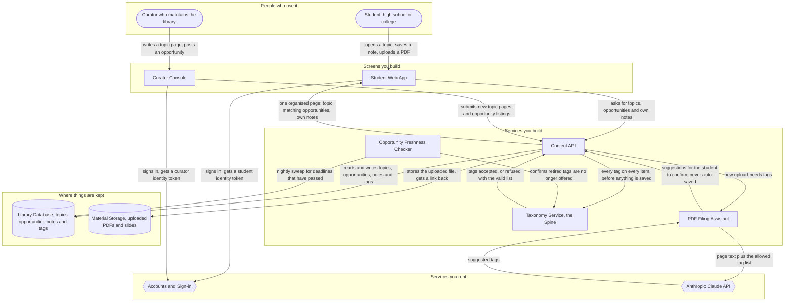

# Pre-Med Study Desk — System Architecture

*A study and opportunity organiser for high school and college students heading toward medicine.*

---

## The Idea

> The project should be an organizational and educational tool for high school students and college students interested in pursuing medicine. It should be able to display different topics (anatomy, virus', etc.) and it should list some opportunities for students (research, volunteering, shadowing). It should also have an area where you can take your own notes and place pdf's and other materials. One thing that it must do well on day one is that it should be organized well first.

Three kinds of content — **topics you read**, **opportunities you apply to**, and **materials you bring** — that most tools would keep in three separate silos. The last sentence of the paragraph is the whole design brief: organisation is not a feature layered on later, it is the thing being built.

### The design consequence of "organized well first"

If topics, opportunities and personal materials each get their own filing system, the student ends up with three navigations, three search boxes, and no way to see that the shadowing listing they just found is in the same specialty as the notes they took last week. That is a disorganised tool no matter how good each silo is.

So the architecture makes one decision and builds everything else around it:

> **One shared vocabulary — body system, discipline, and level — that every item of every type must be filed against before it can be saved.**

The component that owns and enforces that vocabulary is the **Taxonomy Service**, called **the Spine** throughout this document. It is the answer to "what guarantees the day-one requirement." Nothing — not a curated topic page, not an opportunity listing, not a PDF a student drags in at 1am — enters the Library Database without passing through it. Organisation is enforced at the write path, which is the only place it can actually be guaranteed.

---

## Components

Ten components, plus two rented services. Each traces to specific words in the paragraph.

| Component | What it does for this project | The words that required it |
|---|---|---|
| **Student Web App** | The screen a student actually uses — browse topics, scan opportunities, keep a personal shelf of notes and PDFs. | "high school students and college students", "display different topics", "you can take your own notes" |
| **Curator Console** | A small private screen where whoever maintains the library writes topic pages and posts opportunities with their deadlines. | "It should be able to display different topics", "it should list some opportunities" — the content does not write itself |
| **Content API** | The server that decides who is allowed to see and change what, and the only route through which anything reaches the Spine or the database. | "your **own** notes" — private-per-student content cannot be enforced in the browser |
| **Taxonomy Service (the Spine)** | Owns the one shared list of body systems, disciplines and levels, and refuses to let anything be saved without valid tags. | "it should be organized well first" — this is the component that guarantees it |
| **Library Database** | Keeps every topic page, opportunity listing, note and tag so they are still there tomorrow, and lets one query pull all three types for the same subject. | "take your own notes", "list some opportunities" — state outlives the session |
| **Material Storage** | Holds the actual uploaded files — PDFs, slides, scans — which are too big to sit inside the database. | "place pdf's and other materials" |
| **Accounts and Sign-in** | Tells the system which student is asking, so one student's shelf is never another student's shelf. | "**your** own notes" implies identity |
| **Opportunity Freshness Checker** | Runs nightly and pulls listings whose deadline has passed, so the opportunity list never shows dead links. | "list some opportunities (research, volunteering, shadowing)" + "organized well" — an expired listing is disorganisation |
| **PDF Filing Assistant** | Reads an uploaded PDF and suggests which Spine tags it belongs under, so a dropped file never lands untagged. | "place pdf's and other materials" + "organized well first" |
| **Anthropic Claude API** | The rented model the Filing Assistant asks to match a document against the allowed tag list. | Required by the Filing Assistant only |

### Why there is an AI layer at all

Only one job in this system needs meaning rather than matching: taking forty pages of a lecture PDF and deciding it belongs under *Cardiovascular · Physiology · College*. That is extraction and classification against a fixed vocabulary — the one thing here a rule cannot do. Everything else is storage, retrieval and validation, and it is built without a model.

The Assistant **suggests**; the student confirms. It never writes a tag on its own. If it is switched off entirely, the system still works — the student tags the upload by hand from a dropdown. This is deliberate: the day-one requirement cannot depend on a model call succeeding.

### Deliberately not built (and what would change that)

| Not built | Why not | Build it when |
|---|---|---|
| Job queue for uploads | At day-one volume, extracting a PDF and getting tag suggestions is a slow request, not a burst. A spinner is an honest answer for a handful of uploads. | 95th-percentile upload processing passes 30 seconds, or concurrent uploads start colliding |
| Dedicated search engine | Postgres full-text search covers a few thousand items comfortably. | The library passes ~50,000 items, or search latency passes 300ms |
| Opportunity ingestion pipeline | Curators hand-entering listings is correct while there are dozens. | Listings pass ~200, or more than three partner sources need syncing |
| Native mobile app | The web app is responsive; a native app buys offline reading and nothing else yet. | Sustained demand for reading without a connection |

---

## How It Fits Together

**Reading it in one line:** everything a student or curator writes funnels through the Content API and must clear the Spine before it reaches storage, which is why one subject query can return a topic page, a shadowing listing and a personal PDF together.

---

## Data Flow

One real journey, end to end: a student uploads a lecture PDF about the heart, and later sees it sitting beside a cardiology shadowing opportunity.

1. **The student drops in a PDF.** They upload a lecture handout on the cardiovascular system from the Student Web App. The app sends the file to the Content API along with the identity token that says which student this is.

2. **The file is put somewhere durable.** The Content API stores the document in Material Storage and gets back a link. Nothing is filed yet — at this moment the upload is a loose file, which is precisely the state the day-one requirement exists to prevent.

3. **The Filing Assistant proposes where it belongs.** The API hands the new upload to the PDF Filing Assistant, which pulls the page text and sends it to the Anthropic Claude API together with the Spine's allowed tag list. The model returns suggestions — *Cardiovascular · Physiology · College level* — chosen from that list, not invented.

4. **The student confirms.** The suggestions come back to the web app as pre-ticked boxes the student can change. Nothing has been saved to the library yet. If the Filing Assistant is unavailable, this is the step where the student simply picks tags from the dropdown themselves — the journey continues either way.

5. **The Spine has the final say.** The confirmed tags go back through the Content API, which checks every one against the Taxonomy Service. Valid tags are accepted; anything unrecognised is refused with the list of what *is* valid. Only then does the note record land in the Library Database.

6. **The organisation pays off later.** Weeks on, the student opens the Cardiovascular topic. The web app makes one request; the API runs one query across all three content types; the page comes back carrying the curated topic page, the cardiology shadowing listing that a curator posted last month, and the student's own PDF from step 1 — together, because all three were filed against the same Spine.

---

## Build Order

Four phases. Each is defined by what it *proves*, not by what it contains.

### Phase 1 — The Spine and the Topic Library *(make or break)*

Build the Taxonomy Service, the Content API's write path, the Library Database, and topic pages in the Student Web App. Seed the vocabulary with real body systems and disciplines.

**Proves:** that a single shared vocabulary can hold real medical content and that nothing can be written without valid tags. If the vocabulary turns out to be wrong-shaped — too coarse, too fine, or the wrong axes — this is the cheapest possible moment to find out, because only one content type exists. Every later phase inherits this decision.

### Phase 2 — Opportunities and Freshness

Add opportunity listings, the Curator Console, and the nightly Freshness Checker.

**Proves:** that the same Spine holds a *second*, structurally different content type without needing a second filing system. A topic is evergreen; an opportunity has a deadline and dies. If both file cleanly against one vocabulary, the core bet is sound.

### Phase 3 — The Personal Shelf

Add Accounts and Sign-in, Material Storage, personal notes, and PDF upload with manual tagging.

**Proves:** that student-created content joins the same spine as curated content — and that the payoff arrives, because a topic page can now show a student their own material next to the curated page and a live opportunity.

### Phase 4 — The Filing Assistant

Add the PDF Filing Assistant and the Claude API call.

**Proves:** that uploads at volume cannot degrade the organisation. This phase is last on purpose — it is an accelerant on a system that already works, never a dependency of it.

---

## Assumptions

| # | Assumption | Impact if wrong |
|---|---|---|
| 1 | One vocabulary — body system, discipline, level — can file all three content types. | **Foundational.** If topics and opportunities need genuinely different axes, the Spine splits into two and the "one organised page" payoff in step 6 disappears. This is what Phase 1 exists to test. |
| 2 | Content is curated by a small named group, not crowdsourced from students. | Moderate. Open contribution needs moderation, reputation and versioning — a whole subsystem this design does not have. |
| 3 | Students are 13 or older and sign up themselves. | **High.** Younger students, or school-mediated signup, changes consent handling, account provisioning and possibly adds a teacher audience with its own screens. |
| 4 | The material is study support, not clinical guidance. | High. If it is ever read as medical advice, a review and approval workflow becomes mandatory before publication. |
| 5 | Opportunities are hand-entered while there are dozens. | Low now, moderate later — it is the trigger for the ingestion pipeline listed as deferred. |
| 6 | High school and college students share one app, with level as a tag rather than a separate product. | Moderate. If the two audiences need genuinely different experiences, the Student Web App becomes two surfaces on one API. |

### The one question that would most change this design

**Is a student here on their own, or is a school putting them here?**

- **Self-serve student** — the design above is correct as drawn. Accounts are individual, the shelf is private, and there is no third audience.
- **School-mediated** — a teacher or counsellor becomes a first-class user with rosters, assigned reading, and visibility into student progress. That adds an audience, a permissions model with cohorts, and a third screen. It also moves consent onto the institution, which changes what Accounts and Sign-in has to do.

Everything else in this document survives either answer. This one does not.

---

## What This Design Does Not Cover

Named honestly, so nothing here reads as covered when it is not.

- **Medical accuracy review.** There is no editorial approval workflow. Curators can publish. For content teaching anatomy and infectious disease to students, that gap is real and deserves a decision before launch.
- **Minors' data protection in depth.** Assumption 3 has been made, not designed for. Retention, parental consent and data-export rights are unaddressed.
- **Recommending opportunities by fit.** The system filters opportunities by tag; it does not rank them against a student's background or readiness.
- **Progress tracking.** No streaks, mastery scores, quizzes or completion state. The paragraph asked for organisation, not assessment.
- **Social features.** No sharing, comments, study groups or messaging.
- **Application tracking.** The system lists opportunities; it does not track what the student applied to or heard back about.
- **Offline access.** Requires a connection.
- **Accessibility and localisation depth.** Assumed as build standards, not specified here.
- **Cost, hosting and operations.** No estimate of what running this costs, nor where it runs.
